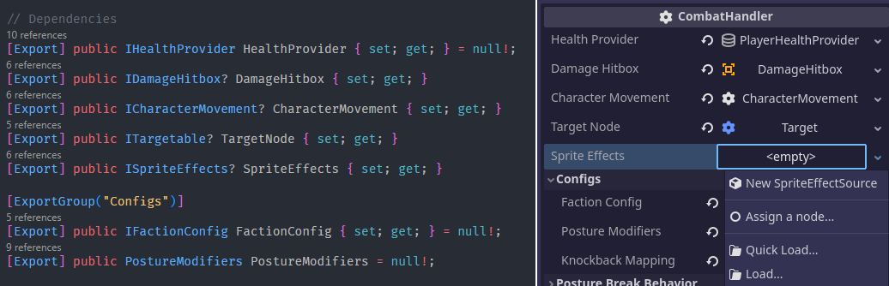
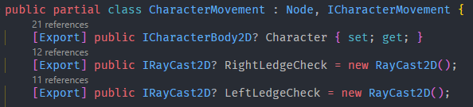
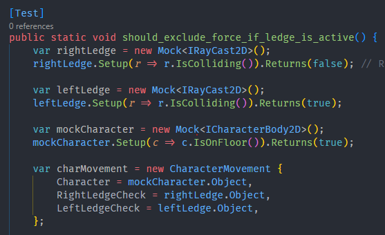

# Godot Interface Export

This is the repository for testing and hosting the [proposed feature to allow exporting C# interface in Godot](https://github.com/godotengine/godot-proposals/issues/8722). The repository itself is a simple Godot game for testing the proposed features and the release section contains prebuilt Godot executables and C# packages for the feature.

I will be maintaining [a fork of Godot](https://github.com/poohcom1/godot/tree/interface-export/master) which includes the original PR as well as follow-up changes. For stability, the fork will be continuously rebased against the latest stable or dev release of Godot.

## Installation

1. Download the latest release from the [release section](https://github.com/poohcom1/godot-interface-export-demo/releases).
2. Install the nuget packages from `GodotSharp/Tools/nupkgs`.
3. Open up this repository or your own game to test out the features.

If you find any bugs or issues, please create an issue on this repository.

## Features

### Interface Export

Base feature; allow C# scripts to export interfaces, which can be set with a Resource or Node that implements it.

- Branch: https://github.com/poohcom1/godot/tree/interface-export/core
- PR: https://github.com/godotengine/godot/pull/86946

### Node drag and drop

Minor patch to allow dragging and dropping nodes onto the interface export property editor (feature parity withe NodePath property editor)

- Branch: https://github.com/poohcom1/godot/tree/interface-export/node-dnd
- PR: TBA

### Native interface

> Declaring and exporting native nodes via interfaces

> Mocking native nodes in unit tests

Larger patch that modifies the GodotSharp package to include interface implementation for all native Godot classes. This will greatly improve code modularity and allow code to be mocked and unit tested much more easily.

For an existing plugin solution, check out https://github.com/chickensoft-games/GodotNodeInterfaces.

- Branch: https://github.com/poohcom1/godot/tree/interface-export/native-interface
- PR: TBA

## Test Checklist

- Interface Export
  - [ ] [Resource] Should accept resources that implement the interface
  - [ ] [Resource] Should show a list of global class resources that implements the interface
  - [ ] [Resource] Should show quick open from `Quick load...` with resources marked with `[GlobalClass]`
  - [ ] [Resource] Should show file picker from `Load...` and verify file after selection
  - [ ] [Resource] Resources drag and drop should work
  - [ ] [Node] Should accept nodes that implement the interface
  - [ ] [Node] Should show the "Pick a node" button if the containing object is a Node
  - [ ] [Node] Should show the "Clear node" button if the node exists
  - [ ] [Node] Nodepath text should be removed if the targeted node is deleted
- Node drag and drop
  - [ ] Should only accept correct nodes
  - [ ] Should accept correct resources (regression)
- Native interface
  - [ ] Should accept pure nodes/resources that implement the native interface
  - [ ] Should accept scripted nodes/resources that implement the native interface
  - [ ] Should support node drag and drop
